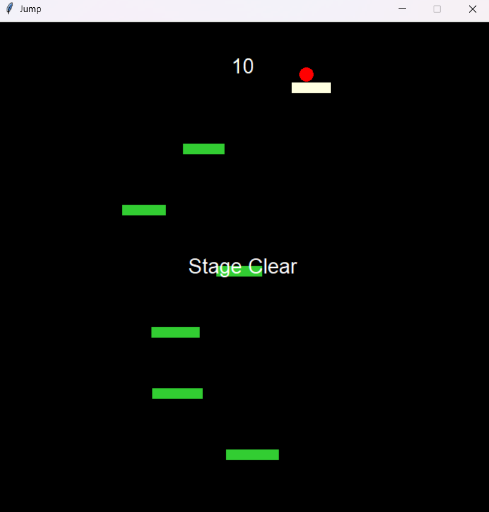

# jump-game

tkinter로 만든 점프게임입니다.
## 실행 화면

## 게임 규칙
* 방향키(←, ↑, →)를 사용해서 움직일 수 있습니다.
    * ←왼쪽, ↑점프, →오른쪽
* 100점을 모으거나 남은 시간이 없으면 게임이 끝납니다.
    * 스페이스바를 눌러 다시 시작할 수 있습니다.
* 스테이지 클리어 시 10점을 얻습니다.
## 주요 기능
* tkinter의 canvas를 사용해서 필요한 요소를 화면에 보여줍니다.
* after() 함수로 화면을 갱신합니다.
```python
window.after(25, draw)
```
* random을 사용해서 플랫폼의 넓이와 위치를 설정했습니다.
    * 다음 플랫폼의 넓이와 위치는 이전 플랫폼의 위치와 크기를 바탕으로 만들어집니다.
    * 점수를 얻으면 플랫폼들이 다시 설정됩니다.
```python
platforms = []
prev_x = random.randint(0, WINDOW_WIDTH-53)
for i in range(1, 8):
    w = 50+i*3
    h = 15
    y = i*81
    platforms.append([prev_x, y, w, h])
    prev_x += random.randint(-150, 150)
    prev_x = max(0, min(prev_x, WINDOW_WIDTH-w))
```
## 참고자료/reference
* [make snake game(YouTube)](https://www.youtube.com/results?search_query=make+snake+game).
* Microsoft Copilot